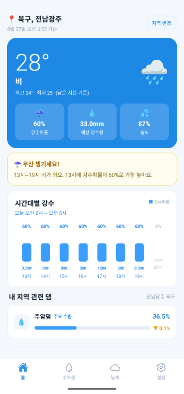
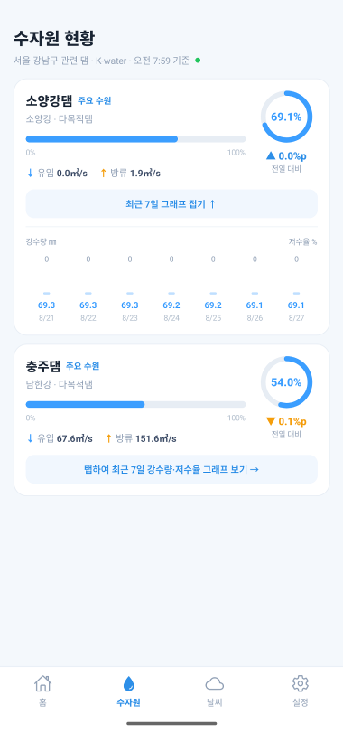
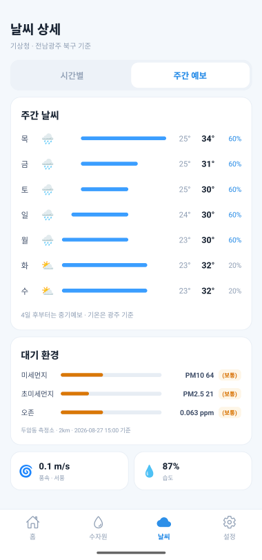
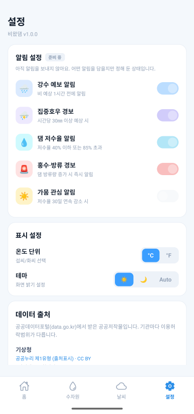
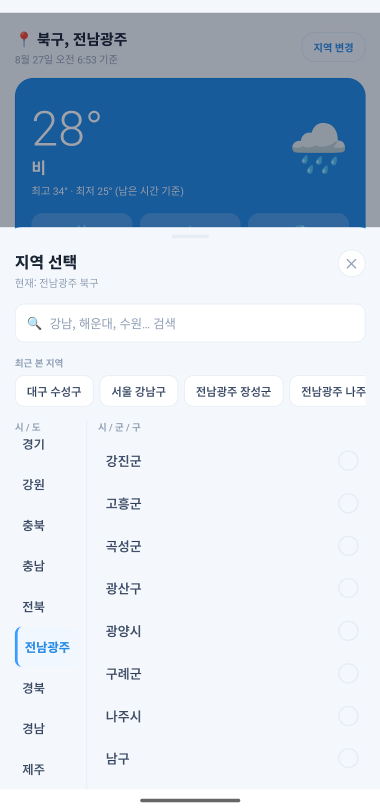

# 비왔댐 (Beeotdam)

내 지역의 **비와 물 상황을 한눈에** 보는 모바일 앱입니다.
날씨 예보와 댐 저수율을 따로 찾아볼 필요 없이 한 앱에서 확인합니다.

> **개발 단계 안내**
> 화면에 뜨는 모든 수치가 **기상청 · K-water · 에어코리아 실제 데이터**입니다.
> 샘플 값은 남아 있지 않습니다.
>
> 실행하려면 공공데이터포털 인증키가 필요합니다. `.env.example`을 참고하세요.

| 홈 | 수자원 | 날씨 | 설정 |
|:--:|:--:|:--:|:--:|
|  |  |  |  |
| 비 오는 날의 전남광주 북구 | 서울 강남구에 물을 대는 두 댐 | 주간 예보와 대기 환경 | 데이터 출처와 표시 설정 |

화면의 숫자는 모두 그때 실제로 받아온 값입니다. 홈과 수자원의 지역이 다른 건
지역마다 관련 댐이 다르다는 걸 함께 보이려고 그렇게 찍었습니다.

---

## 화면

### 🏠 홈

하루를 시작할 때 필요한 정보를 위에서부터 순서대로 보여줍니다.

- 현재 기온·최고·최저·강수확률·습도
- 우산 알림 — 비 오는 시간대와 최고 강수확률. 비 소식이 없으면 카드가 안 나옵니다
- **시간대별 강수 차트** — 오늘 06시~20시. 지난 시각은 흐리게, 열면 현재 시각으로 스크롤
  - 막대는 강수확률(0~100%)입니다. 강수량은 0보다 클 때만 아래에 ㎜로 붙습니다
- **내 지역 관련 댐** — 보고 있는 지역에 물을 대는 댐의 저수율과 전일 대비 증감
- 주간 날씨 7일치 — 단기예보 4일 + 중기예보 3일

### 💧 수자원

보고 있는 지역에 물을 대는 댐의 저수 상황을 봅니다. 전국 목록이 아닙니다.

- 댐별 카드
  - 원형 저수율 게이지와 진행바, 전일 대비 증감(%p)
  - `주요 수원` / `관련 수원` 배지 — 공식 자료가 그 지역을 콕 집어 말했는지에 따라 다릅니다
  - 유입량 / 방류량 (㎥/s)
  - 탭하면 최근 7일 강수량·저수율 그래프가 펼쳐짐
- **홍수 경보** — 현재 수위가 댐별 기준을 넘으면 나옵니다. 평상시에는 아무것도 안 붙습니다
  - `홍수기 제한수위 초과` 주황 / `계획홍수위 초과` 빨강
  - 게이지·진행바도 같은 색으로 바뀝니다
- 연결된 댐이 없는 지역은 그 이유를 알려줍니다 (제주는 지하수, 대전·부산은 자체 취수)

**상태 배지(양호·주의)와 저수율 필터는 두지 않았습니다.** 저수율만으로 가뭄 단계를 정할
근거가 없기 때문입니다. 자세한 이유는 `src/components/water/dam-card.tsx` 주석에 있습니다.

### 🌦️ 날씨

- **시간별 / 주간 예보** 전환
- 시간별 — 06시~20시 강수확률과 강수량, 하늘 상태 아이콘, 현재 시각 강조
- 주간 — 홈의 주간 날씨 목록을 그대로 사용
- 풍속·풍향 · 습도 · 일출 · 일몰
- **대기 환경** — 미세먼지(PM10) · 초미세먼지(PM2.5) · 오존
  - 어느 측정소 값인지, 얼마나 떨어져 있는지, 언제 잰 값인지 카드 아래에 밝힙니다

기압·가시거리 타일은 뺐습니다. 지금 쓰는 API에 없는 값이라 빈 칸만 남습니다.
일출·일몰은 API 값이 아니라 지역 좌표로 계산합니다(`src/lib/sun.ts`).

자외선지수는 넣지 않았습니다. 에어코리아가 아니라 기상청 생활기상지수 소관이라
서비스를 따로 신청해야 하는데, 지표 하나를 위해 늘리지 않기로 했습니다.

### ⚙️ 설정

- 알림 5종 — 강수 예보, 집중호우, 댐 저수율, 홍수·방류, 가뭄
  - **아직 알림을 보내지 않습니다.** 어떤 알림을 담을지만 정해 둔 상태라
    `준비 중`을 붙이고 스위치를 잠가 두었습니다
- 온도 단위(°C / °F), 테마(라이트 / 다크 / 자동)
- 설정값과 보던 지역 모두 기기에 저장돼 **앱을 껐다 켜도 유지**됩니다
- **데이터 출처** — 기관별 이용허락범위. 출처표시가 이용 조건이라 화면에 둡니다

### 📍 지역 선택

홈의 `지역 변경`을 누르면 올라오는 시트에서 고릅니다.

- 전국 시/군/구 254곳 — 시/도를 고른 뒤 목록에서 선택
- 검색은 시/도를 가로질러 찾습니다 (`동탄`을 치는 데 경기도를 먼저 고를 필요가 없게)
- **최근 본 지역**이 자동으로 쌓여 시트 위쪽에 나옵니다. 담아두는 조작은 없습니다



---

## 시작하기

### 요구 사항

- Node.js
- Android 에뮬레이터 또는 [Expo Go](https://expo.dev/go)가 설치된 실기기

### 설치

```bash
npm install
```

### 실행

```bash
npm run android   # Android
npm run ios       # iOS
npm run web       # 웹
```

Expo Go에 포함된 패키지만 사용하므로 **별도의 네이티브 빌드 없이 바로 실행**됩니다.

> 개발은 Android 에뮬레이터에서 진행했습니다. iOS와 웹은 코드상 지원되지만 실기기 확인은 하지 않았습니다.

---

## 기술 스택

| 항목 | 버전 |
|---|---|
| Expo SDK | 57 |
| React Native | 0.86 |
| expo-router | 57 (파일 기반 라우팅) |
| TypeScript | strict |
| react-native-svg | 원형 게이지, 그라디언트 |
| @expo/vector-icons | 탭 바 아이콘 |
| AsyncStorage | 설정값 저장 |

### 쓰는 공개 API

모두 [공공데이터포털](https://www.data.go.kr)에서 신청합니다. 인증키는 계정당 하나로
모든 서비스에 함께 씁니다.

| 서비스 | 쓰는 곳 | 일일 한도 |
|---|---|---|
| 기상청_단기예보 조회서비스 | 현재 날씨, 시간대별 강수, 3일 예보 | 10,000 |
| 기상청_중기예보 조회서비스 | 주간 날씨 4~7일 | 10,000 |
| 한국수자원공사_수문 운영 정보 | 댐 저수율·유입·방류 | 10,000 |
| 한국수자원공사_수문 제원 현황 | 댐 수위 기준 (한 번 받아 적어 둠) | 100 |
| 한국환경공단_대기오염정보 | 미세먼지·초미세먼지·오존 | 10,000 |
| 한국환경공단_측정소정보 | 측정소 좌표 (한 번 받아 적어 둠) | 10,000 |

`수문 제원 현황`과 `측정소정보`는 실행 중에 부르지 않습니다. 값이 변하지 않아
`src/data/dam-catalog.ts`와 `src/data/air-stations.ts`에 적어 두고 씁니다.

기관마다 규칙이 조금씩 달라 `src/api/http.ts`가 그 차이를 흡수합니다. 응답 형식
지정부터 셋이 다릅니다.

| 기관 | 형식 지정 | 값 |
|---|---|---|
| 기상청 | `dataType` | `JSON` (대문자) |
| K-water | `_type` | `json` |
| 에어코리아 | `returnType` | `json` |

실패해도 HTTP 200을 주고, 인증키 오류는 JSON을 요청해도 XML로 돌아옵니다.
초당 요청 제한도 있습니다.

### 이용허락범위

기관마다 조건이 다릅니다. 2026년 8월 각 서비스 페이지에서 확인한 값입니다.

| 제공기관 | 이용허락범위 | CC | 쓰는 서비스 |
|---|---|---|---|
| 기상청 | 공공누리 **제1유형** (출처표시) | `CC BY` | 단기예보, 중기예보 |
| 한국수자원공사 | **제한 없음** | — | 수문 운영 정보 |
| 한국환경공단 | 공공누리 **제3유형** (출처표시·변경금지) | `CC BY-ND` | 에어코리아 대기오염정보, 측정소정보 |

서비스 페이지는 공공누리 배지와 크리에이티브 커먼즈 배지를 나란히 걸어 둡니다. 조건이
하나 더 붙는 게 아니라 같은 말을 국제 라이선스로 다시 쓴 것입니다 — 제1유형이 `CC BY`,
제3유형이 `CC BY-ND`에 대응합니다. 화면에는 둘을 병기합니다.

출처표시가 이용 조건이라 설정 탭에 `데이터 출처` 카드를 두고 기관별로 밝힙니다
(`src/components/settings/data-source-card.tsx`).

제3유형의 **변경금지** 때문에 대기 환경은 받은 값을 그대로 보여줍니다. 등급도 우리가
구간을 만들지 않고 응답의 등급 필드를 씁니다. 저수율과 기온도 계산하지 않습니다.

---

## 프로젝트 구조

```
src/
├─ app/                    화면 (expo-router 파일 기반 라우팅)
│  ├─ _layout.tsx
│  ├─ index.tsx            홈
│  ├─ water.tsx            수자원
│  ├─ weather.tsx          날씨
│  └─ settings.tsx         설정
│
├─ api/                    공공데이터포털 호출
│  ├─ http.ts              인증·타임아웃·오류 판별 (기관마다 다른 규칙 흡수)
│  ├─ grid.ts              위경도 → 기상청 격자 좌표
│  ├─ kma-time.ts          발표일자·발표시각 계산
│  ├─ kma.ts               단기예보·초단기실황 → 화면용 형태로 재조립
│  ├─ kma-mid.ts           중기예보 (4~7일). 육상예보 + 기온
│  ├─ kwater.ts            댐 수문 정보. 시간별 7일치를 날짜별로 접어 쓴다
│  └─ airkorea.ts          대기오염정보. 시/도로 받아 우리 측정소만 골라낸다
│
├─ components/
│  ├─ app-tabs.tsx         하단 탭 바 (웹은 app-tabs.web.tsx)
│  ├─ common/              화면을 가리지 않는 공용 조각 (스켈레톤)
│  ├─ region/              지역 선택 시트
│  ├─ home/                홈 전용 컴포넌트
│  ├─ water/               수자원 전용 컴포넌트
│  ├─ weather/             날씨 전용 컴포넌트
│  └─ settings/            설정 전용 컴포넌트
│
├─ constants/
│  └─ app-theme.ts         색상·여백·모서리 토큰 (네 화면 공용)
│
├─ theme/
│  └─ theme-context.tsx    라이트/다크 팔레트 + 테마 설정 보관
│
├─ settings/
│  └─ settings-context.tsx 보는 지역·최근 지역·알림·온도 단위 보관
│
├─ weather/
│  ├─ weather-context.tsx  날씨 조회 + 캐시. 단기·중기를 합쳐 주간 목록을 만든다
│  ├─ air-context.tsx      대기질 조회 + 캐시 (캐시는 측정소 단위)
│  └─ failure-message.ts   실패 종류별 안내 문구와 오류 화면 문구
│
├─ water/
│  └─ dam-context.tsx      지역 관련 댐 조회 + 캐시 (캐시는 댐 단위)
│
├─ hooks/
│  └─ use-persisted-state.ts  useState + 기기 저장/복원
│
├─ lib/
│  ├─ dam.ts               홍수 경보 판정 (현재 수위 vs 댐별 기준)
│  ├─ sun.ts               일출·일몰 계산 (NOAA 계산식)
│  └─ storage.ts           AsyncStorage 래퍼 (JSON 변환·키 관리)
│
└─ data/
   ├─ index.ts             재수출 — 사용하는 쪽은 '@/data'만 참조
   ├─ regions.ts           전국 시/군/구 254곳 (자동 생성)
   ├─ mid-regions.ts       시/도별 중기예보 구역코드
   ├─ dam-catalog.ts       댐 15곳의 코드·하천·수위 기준
   ├─ region-dams.ts       지역 ↔ 댐 용수공급 관계 + 근거
   ├─ air-stations.ts      지역별 대기질 측정소 253곳 (자동 생성)
   └─ settings.ts          알림 항목, 앱 정보
```

### 데이터

`src/data/`는 도메인별로 나뉘어 있고 `index.ts`가 다시 내보냅니다. 사용하는 쪽은 항상
`@/data`만 바라보므로, **실제 API를 붙일 때 모듈 하나씩 교체해도 import는 바뀌지 않습니다.**
날씨·댐·대기 환경이 그렇게 교체됐고, 샘플은 남아 있지 않습니다.

이제 `src/data/`에 남은 것은 **변하지 않는 값**뿐입니다. 지역 좌표, 댐 코드와 수위 기준,
지역-댐 관계, 측정소 위치, 알림 항목. 저수율이나 기온처럼 계속 바뀌는 값은 여기 두지 않습니다.

### 지역과 댐

`region-dams.ts`가 지역과 댐을 잇습니다. K-water 공식 자료로 확인되는 관계만 넣고,
근거를 `source`에 남깁니다. 근거가 없는 지역은 비워 둡니다 — 지금 254곳 중 149곳이
연결돼 있습니다.

근거를 잇는 방식이 두 단계입니다. 「광역상수도 공급 지자체 및 담당 지사 현황」은
`지자체 → 담당 지사`까지만 알려주므로, 유역본부 자료가 `댐 → 계통`을 밝힌 경우나
지사·계통 이름이 댐 이름과 같은 경우만 이었습니다.

지역의 저수율을 만들지 않습니다. 여러 댐이 걸린 지역이라도 평균내지 않고 댐마다
따로 보여줍니다. '이 지역 물은 이 댐에서만 온다'고 말하지도 않습니다 — 지자체가
자체 취수하는 물도 있고, 지자체가 관리하는 댐(광주 동복댐 등)은 K-water 자료에
아예 없습니다.

### 대기 환경 측정소

에어코리아는 지역이 아니라 **측정소 단위**로 값을 줍니다. 그래서 지역 좌표에서 가장 가까운
도시대기 측정소를 미리 골라 `air-stations.ts`에 적어 둡니다.

이름으로 맞추지 않고 좌표 거리로 고릅니다. 측정소 이름이 행정구역과 다른 경우가 많습니다
(`한강대로`·`청계천로`·`도산대로`). 도로변대기 측정소는 차량 배기 영향이 커서 그 동네 공기를
대표하지 않으므로 제외합니다.

후보는 **실시간 조회가 돌려주는 목록**에서만 고릅니다. 측정소정보에만 있는 이름을 골라 두면
조회할 때 찾지 못합니다. 253곳 전부 실시간 목록에 있는지 확인했습니다.

30km보다 먼 측정소는 넣지 않았습니다. 254곳 중 **옹진군만 빠졌습니다** — 백령도라 가장 가까운
인천 측정소가 158km입니다. 그 값을 백령도 공기라고 할 수 없어 화면에 이유를 적습니다.

등급은 **1시간 기준**(`pm10Grade1h`)을 씁니다. 필드 이름이 짧은 `pm10Grade`가 24시간 이동평균
기준이어서, 1시간 농도에 그 등급을 붙이면 PM10 41이 `좋음`으로 나옵니다.

### 날씨 불러오기

캐시를 먼저 보여주고 뒤에서 새로 받아옵니다. 앱을 켜자마자 지난번 값이 떠서 기다리는
시간이 없고, 새 값이 도착하면 조용히 바뀝니다. 대신 화면은 **언제 기준인지 반드시 함께
표시합니다.** 오래된 값을 현재값인 척 보여주면 안 되기 때문입니다.

실패해도 이미 있는 값은 지우지 않습니다. 1시간 전 기온이 빈 화면보다 낫습니다.
보여줄 값이 하나도 없을 때만 스켈레톤이 나옵니다.

기상청은 지나간 시각을 예보에서 빼기 때문에, 저녁에 조회하면 오늘 최저기온(새벽 6시 값)이
사라집니다. 그래서 한 번 받은 오늘의 최고·최저는 그날이 끝날 때까지 따로 기억해 둡니다.

#### 예보의 경계

단기·중기예보는 경계에서 모양이 흐트러집니다. 겪은 것 두 가지를 적어 둡니다.

**단기예보 끝에는 하루가 안 되는 조각이 붙습니다.** 8월 24일 02시 발표는 28일치를 한 시각만
실어 보냈고, 강수확률 하나뿐이고 최고·최저기온이 없었습니다. 그걸 하루로 세면 주간 목록에서
중기예보를 덮어 그날 기온이 사라집니다. 최고·최저기온이 둘 다 없는 앞으로의 날짜는 버립니다.
오늘은 예외입니다 — 늦은 시각에 받으면 최저기온이 이미 지나갑니다.

**중기예보는 시작 날짜가 발표 시각마다 밀립니다.** 06시 발표는 4일 후부터 값이 오는데, 18시
발표는 4일 후가 비어 있고 5일 후부터 옵니다. 그 자리가 단기예보 몫이라 내보내지 않는 것입니다.
시작을 못 박지 않고 범위를 훑으면서 빈 날은 건너뜁니다. 빈 날 판정은 날씨 문구와 기온이 모두
없는 것으로 합니다 — 강수확률은 없을 때 0으로 물러지게 되어 있어 기준으로 쓸 수 없습니다.

### 설정 저장

설정값은 화면이 아니라 Provider가 들고 있고(`theme/`, `settings/`), 저장은 `usePersistedState` 훅이 맡습니다.
`useState`와 쓰는 법이 같아서 화면 코드는 저장을 신경 쓰지 않습니다.

```tsx
const [unit, setUnit, loaded] = usePersistedState(StorageKeys.tempUnit, 'c')
```

디스크 읽기는 비동기라, 다 읽어올 때까지 스플래시를 붙잡아 둡니다.
그러지 않으면 다크 모드로 저장해 둔 사용자에게 라이트 모드 화면이 한 프레임 스칩니다.

AsyncStorage 호출은 `lib/storage.ts` 한 곳에만 있으므로, 저장소를 바꿔도 나머지 코드는 그대로입니다.

---

## 남은 작업

- [x] 다크 모드
- [x] 설정값 영구 저장
- [x] 전국 시/군/구 지역 선택
- [x] 기상청 연동 — 현재 날씨, 우산 알림, 시간대별 강수, 시간별 목록
- [x] 주간 날씨 — 중기예보 연동
- [x] K-water 연동 — 지역 관련 댐 저수율, 홍수 경보
- [x] 오류 화면 — 종류별 안내와 재시도
- [x] 대기 환경 — 에어코리아 연동. 마지막 샘플이 사라졌다

배포하려면 남은 것

- [x] 공공데이터 이용허락 조건 확인 후 출처 표시
- [ ] **API 키 보호** — 지금은 앱 안에 있어 꺼내볼 수 있다. 중계 서버가 필요하다
- [x] 린트 오류 정리 — toggle-switch의 ref 접근, use-color-scheme.web의 effect setState
- [ ] iOS 실기기 확인
- [x] 웹 확인 — 템플릿 탭바 제거, 제목·lang·favicon 정리

더 채울 것

- [ ] 지역-댐 연결 확대 — 254곳 중 149곳. 남은 지역은 지사↔댐 근거가 필요하다
- [ ] **알림 구현** — 지금은 껍데기다. 강수·집중호우는 로컬 알림으로 되지만,
      저수율·홍수·가뭄은 앱이 꺼져 있을 때도 값을 봐야 해서 서버가 필요하다
- [ ] 로딩 화면 — 캐시가 있으면 거의 안 보여서 뒤로 미뤘다
- [ ] 발표 시각 경계 점검 — `base_time`·`tmFc`가 넘어가는 시각에 열어 보기
